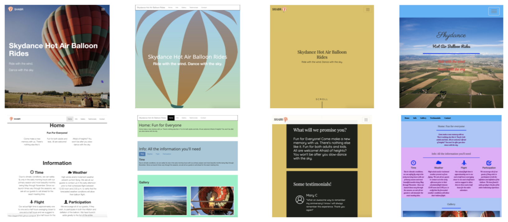

# SHABR
---
_The purpose of this repository is to help you practice using HTML, CSS, and Bootstrap._

## Context
* Your college roommate is not only a hot air balloon enthusiast, but they just got their pilot's license and is ready to start a business! They have decided to name it **SHABR**: Skydance Hot Air Balloon Rides. 
* Of course, your roommate needs a website built, so obviously, they turn to you! Your roommate has agreed to give you 10% of the profits during the first 2 years of business! So it is in your best interest to make this website look as good as possible!
* Your roommate has given you the content, so all you have to do is put your web design skills to the test!

## Examples
* A full example can be found in the `example` sub-directory of this repo.
* You can either preview it locally, or [here](http://bmuellerhstat.github.io/shabr/example/).
* Your page should be **unique**, so you should **NOT** be copying/paste any of that code.
* As you can see below, there are _many_ ways to use the _same_ content to make a _unique_ website:

## Content
* All of the raw content can be found in `raw.txt`. As the designer, feel free to use your judgment about the order and other minor changes, but do not change any of the content.
* All of the pictures can be found in the `img` sub-directory. 
  * As a reminder, reference them using `img/balloon-#.jpg`.
  * Using the balloon clipart is completely **optional**.
* Put your HTML content in `index.html`
* Put your CSS style in `style.css`
* You probably won't need to use `script.js`, but it's there if you do need it.

## Plan/sketch
* The best results are always backed by thorough planning. Before jumping into the Directions below, it is recommended that you plan out a reasonable layout for the content. Here are a bunch of free tools for sketching a design:
  * [Google Drawings](https://drawings.google.com) (easiest to use!)
  * Other browser-based tools
    * [Wireframe.cc](https://wireframe.cc/)
    * [Figma](https://www.figma.com/wireframe-tool/)
    * [Mockflow](https://www.mockflow.com/)
  * Downloadable programs
    * [Adobe XD](https://www.adobe.com/products/xd.html)
    * [Miro](https://miro.com/apps/)
    * [JustinMind](https://www.justinmind.com/free-wireframing-tool)
  * Paper-and-pencil
    * [SneakPeekIt](https://sneakpeekit.com/)

## Requirements
**Your task is to use all of the provided content, along with your knowledge of HTML, CSS, and Bootstrap to create a fake "SHABR" website.**
* [20%] Use all content in raw.txt
* [20%] HTML: Use your own tags (`h#`, `p`, `ul`, etc)
* [20%] CSS: Use your own color palette and font(s)
* [20%] Bootstrap grid row(s)/column(s): responsive layout between phones/computers.
* [20%] At least two Boostrap components meaningfully: accordion, carousel, navbar, etc.

## Directions
* Clone this repository into your IDE.
* You must ONLY work on your code in your IDE.
* It is recommended that you `add`/`commit`/`push` throughout your progress.
* When you are completely finished, `add`/`commit`/`push` your work to Github.